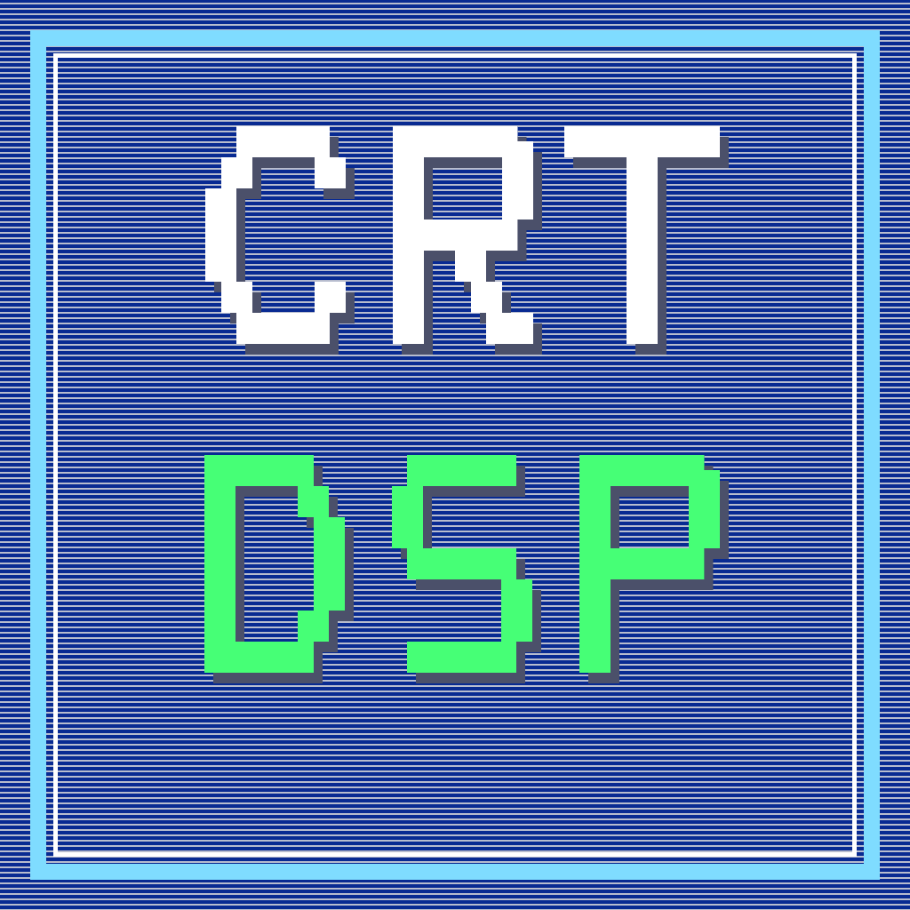
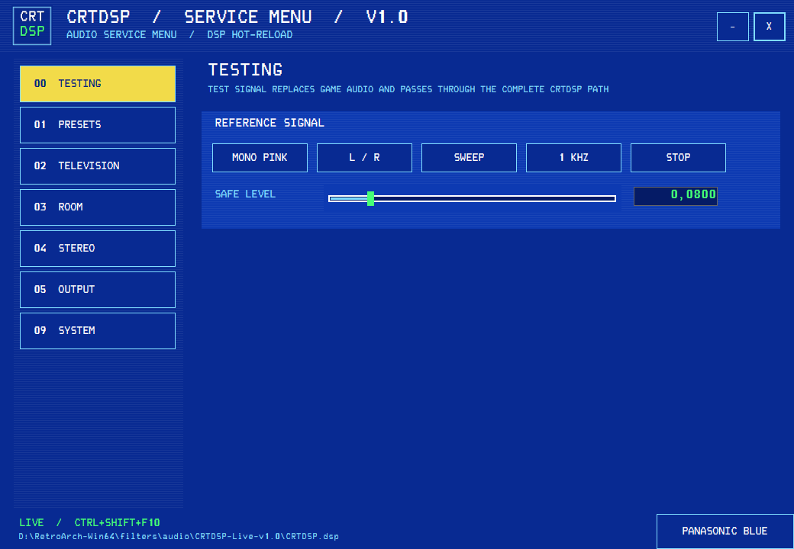

  

<h1 align="center">CRTDSP</h1>

  A live-configurable CRT television audio simulation for RetroArch.

CRTDSP was created to make emulated games feel less like audio coming directly from a modern PC and more like a real console connected to a television in a room. Its goal is not perfect hardware measurement or archival accuracy. It is a perceptual effect: the small cabinet, limited speaker, reflections, stereo collapse and faint line-frequency whine that helped define the experience of sitting in front of a CRT.

The DSP combines a television speaker/cabinet impulse response, a room impulse response, early reflections, speaker saturation, presence shaping, stereo geometry, crossfeed and a recording of CRT whine. The supplied configurator exposes the complete signal path as a television service menu and writes changes directly to one live `.dsp` file.

## Preview

## Features

- live parameter updates while RetroArch is running;
- Clean, Balanced and Immersive starting presets;
- separate television, room, stereo and output controls;
- reference signals for matching headphones and speakers;
- four service-menu color themes;
- global `Ctrl+Shift+F10` overlay hotkey;
- tray minimization and a standalone Windows x64 executable;
- TV, room and whine WAV data embedded in the DSP library.

## Installation

1. Download the latest release archive.
2. Copy the complete `CRTDSP-Live-v1.1` folder to `RetroArch/filters/audio/`.
3. In RetroArch, open `Settings > Audio > DSP Plugin` and select `CRTDSP.dsp`.
4. Run `CRTDSP-Control.exe` from the same folder.
5. Press `Ctrl+Shift+F10` to show or hide the service menu.

The configurator edits `CRTDSP.dsp` atomically. The running DSP normally applies a change within 250 ms; RetroArch does not need to be restarted and the library does not need to be rebuilt.

Start with **Balanced**. Use **Clean** when you want the effect to stay subtle, or **Immersive** when you want the room and physical-TV impression to be more obvious. Every value remains editable after applying a preset.

## CRT whine

The **CRT Whine** control adds a high-frequency line whine recorded from a real CRT. This sound is mostly noticeable to younger listeners, often only up to roughly the late teens or twenties, but hearing range varies a lot from person to person, headphones, speakers and volume level.

If you do not hear it, try raising the level slowly. The author's personal audible calibration point is around `0.35`; the default release value is much lower because high-frequency tones can become uncomfortable quickly.

## Video

A video demo will be recorded and added soon.

## Documentation

- [Settings reference](docs/SETTINGS.MD)
- [Credits, sources and licenses](docs/LICENSES.MD)

## Changelog

### 1.1

- Added a live DSP bypass switch: `filter0_dsp_enabled`.
- Added a **MASTER DSP** block in CRTDSP Control with `DSP ON / DSP OFF`.
- Bypass mode keeps RetroArch using the loaded DSP plugin while returning original game audio.
- Turning DSP off also stops the calibration generator.
- Built-in presets re-enable DSP when applied.
- Added test coverage for live bypass reload behavior.

## Audio sources

CRTDSP uses three embedded audio resources:

- a processed television speaker/cabinet impulse response;
- a processed room impulse response;
- a processed excerpt of [CRT TV Whine by Fission9](https://freesound.org/people/Fission9/sounds/693863/), recorded from a 14-inch PAL JVC television and published under CC0 1.0.

Detailed provenance and redistribution notes are kept in [LICENSES.MD](docs/LICENSES.MD).

## Notes

CRTDSP is an independent project for use with RetroArch and is not affiliated with the RetroArch or libretro projects. The line-frequency recording can be uncomfortable at high levels; begin quietly and increase it only if necessary.
